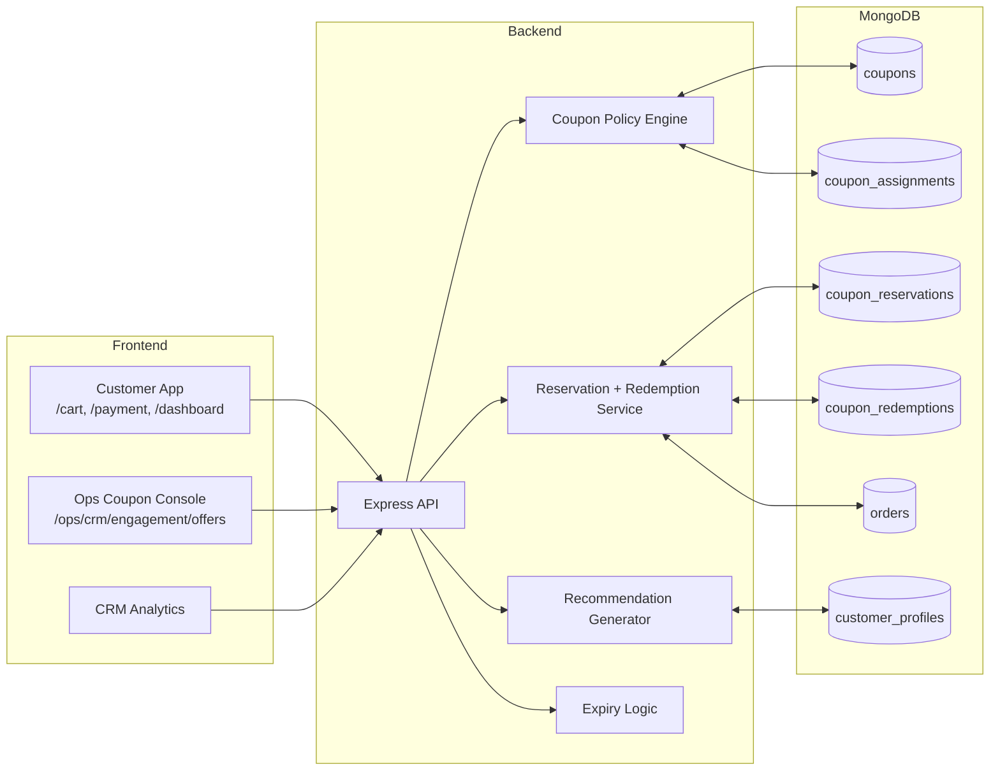
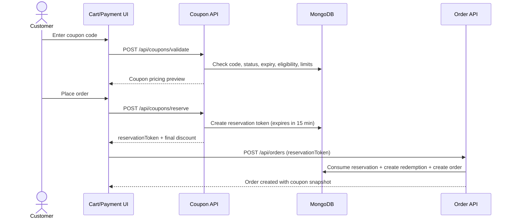
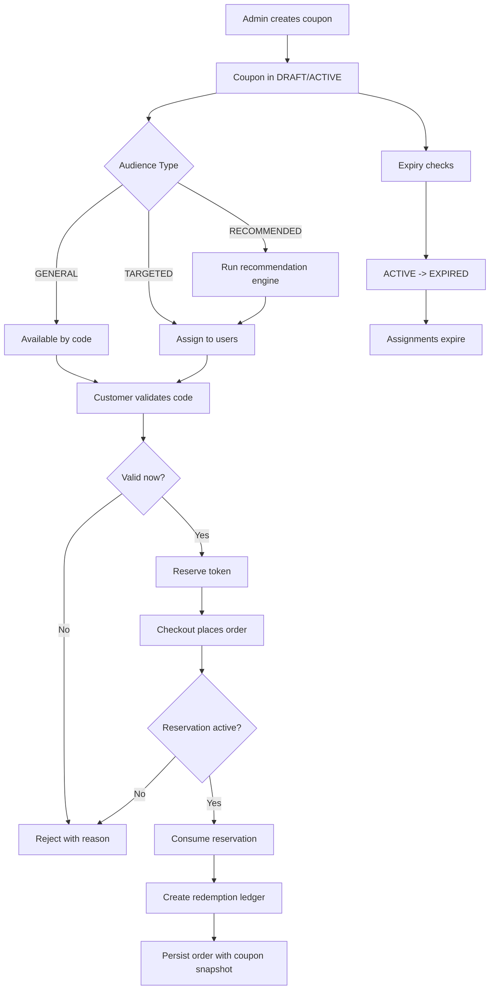
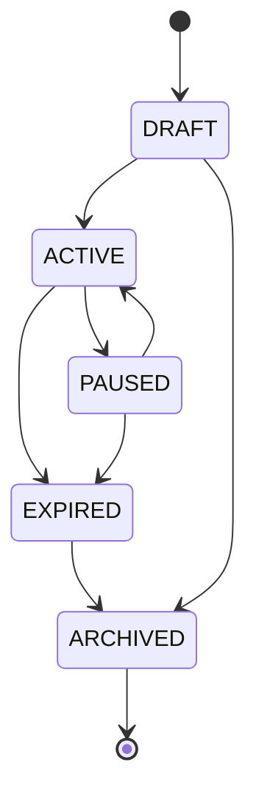

# Bake-Ree Coupon & Promo System Architecture

This document defines the coupon management and promo code lifecycle across customer checkout, CRM recommendations, and ops/admin governance.

## 1) Architecture Diagram

## 2) Sequence Diagram (Apply + Checkout)

## 3) Complete System Flow Diagram

## 4) Coupon Status State Diagram

