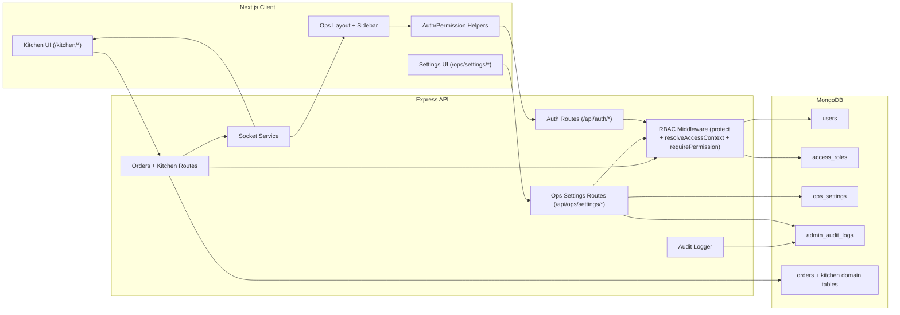
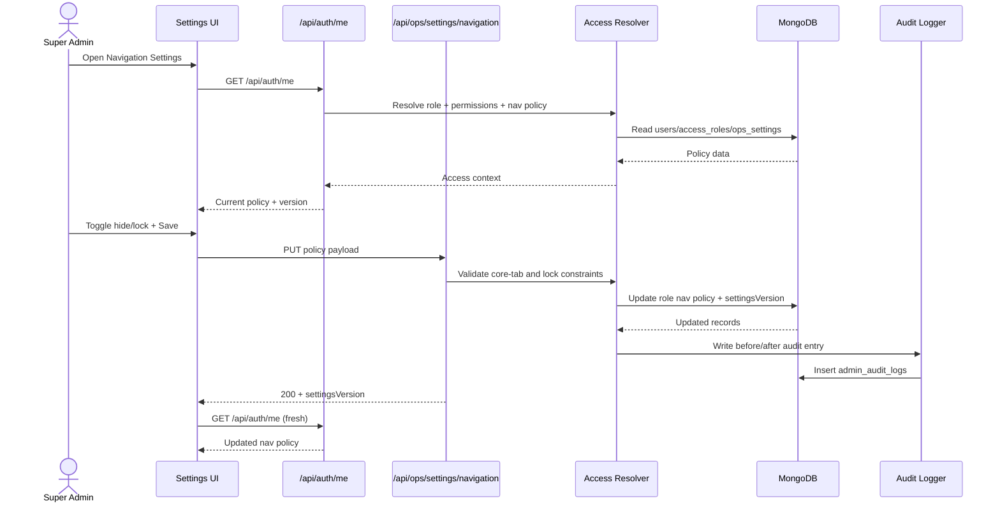
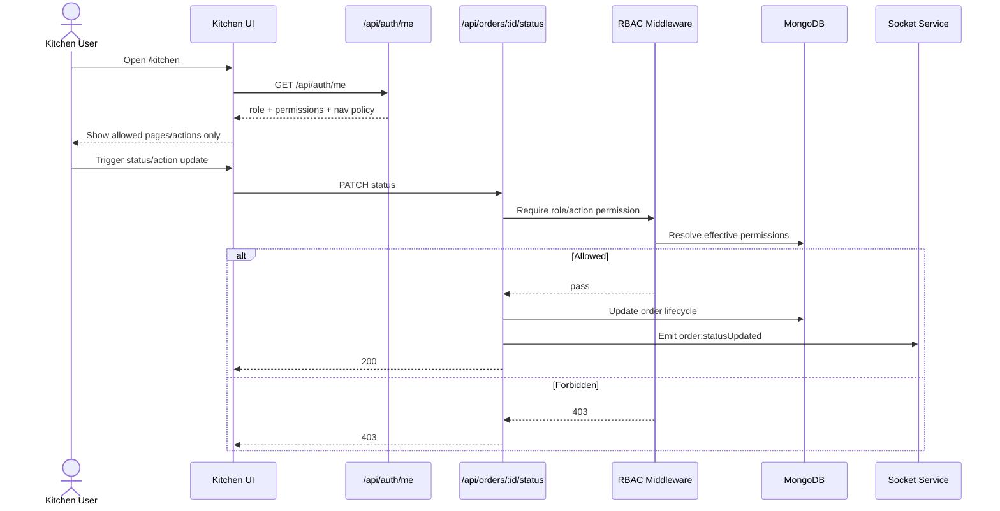
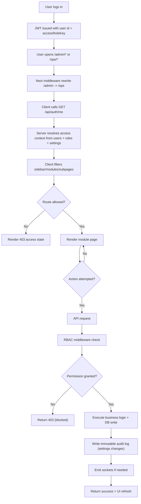

# Ops RBAC Architecture

## High-Level Architecture

```mermaid
flowchart LR
  subgraph Client["Next.js Client"]
    A1["Ops Layout + Sidebar"]
    A2["Settings UI (/ops/settings/*)"]
    A3["Kitchen UI (/kitchen/*)"]
    A4["Auth/Permission Helpers"]
  end

  subgraph API["Express API"]
    B1["Auth Routes (/api/auth/*)"]
    B2["Ops Settings Routes (/api/ops/settings/*)"]
    B3["Orders + Kitchen Routes"]
    B4["RBAC Middleware (protect + resolveAccessContext + requirePermission)"]
    B5["Audit Logger"]
    B6["Socket Service"]
  end

  subgraph DB["MongoDB"]
    C1["users"]
    C2["access_roles"]
    C3["ops_settings"]
    C4["admin_audit_logs"]
    C5["orders + kitchen domain tables"]
  end

  A1 --> A4
  A2 --> B2
  A3 --> B3
  A4 --> B1
  B1 --> B4
  B2 --> B4
  B3 --> B4
  B4 --> C1
  B4 --> C2
  B2 --> C3
  B2 --> C4
  B3 --> C5
  B3 --> B6
  B6 --> A1
  B6 --> A3
  B5 --> C4
```

## Sequence: Admin Navigation Lock/Hide Update

```mermaid
sequenceDiagram
  actor SA as Super Admin
  participant UI as Settings UI
  participant AUTH as /api/auth/me
  participant SET as /api/ops/settings/navigation
  participant RBAC as Access Resolver
  participant DB as MongoDB
  participant AUD as Audit Logger

  SA->>UI: Open Navigation Settings
  UI->>AUTH: GET /api/auth/me
  AUTH->>RBAC: Resolve role + permissions + nav policy
  RBAC->>DB: Read users/access_roles/ops_settings
  DB-->>RBAC: Policy data
  RBAC-->>AUTH: Access context
  AUTH-->>UI: Current policy + version

  SA->>UI: Toggle hide/lock + Save
  UI->>SET: PUT policy payload
  SET->>RBAC: Validate core-tab and lock constraints
  RBAC->>DB: Update role nav policy + settingsVersion
  DB-->>RBAC: Updated records
  RBAC->>AUD: Write before/after audit entry
  AUD->>DB: Insert admin_audit_logs
  SET-->>UI: 200 + settingsVersion
  UI->>AUTH: GET /api/auth/me (fresh)
  AUTH-->>UI: Updated nav policy
```

## Sequence: Kitchen Action Enforcement

```mermaid
sequenceDiagram
  actor KP as Kitchen User
  participant KUI as Kitchen UI
  participant AUTH as /api/auth/me
  participant ORD as /api/orders/:id/status
  participant MW as RBAC Middleware
  participant DB as MongoDB
  participant SOCK as Socket Service

  KP->>KUI: Open /kitchen
  KUI->>AUTH: GET /api/auth/me
  AUTH-->>KUI: role + permissions + nav policy
  KUI-->>KP: Show allowed pages/actions only

  KP->>KUI: Trigger status/action update
  KUI->>ORD: PATCH status
  ORD->>MW: Require role/action permission
  MW->>DB: Resolve effective permissions
  alt Allowed
    MW-->>ORD: pass
    ORD->>DB: Update order lifecycle
    ORD->>SOCK: Emit order:statusUpdated
    ORD-->>KUI: 200
  else Forbidden
    MW-->>ORD: 403
    ORD-->>KUI: 403
  end
```

## Complete System Flow

```mermaid
flowchart TD
  S1["User logs in"] --> S2["JWT issued with user id + accessRoleKey"]
  S2 --> S3["User opens /admin/* or /ops/*"]
  S3 --> S4["Next middleware rewrite /admin -> /ops"]
  S4 --> S5["Client calls GET /api/auth/me"]
  S5 --> S6["Server resolves access context from users + roles + settings"]
  S6 --> S7["Client filters sidebar/modules/subpages"]
  S7 --> S8{"Route allowed?"}
  S8 -- No --> S9["Render 403 access state"]
  S8 -- Yes --> S10["Render module page"]
  S10 --> S11{"Action attempted?"}
  S11 -- No --> S10
  S11 -- Yes --> S12["API request"]
  S12 --> S13["RBAC middleware check"]
  S13 --> S14{"Permission granted?"}
  S14 -- No --> S15["Return 403 (blocked)"]
  S14 -- Yes --> S16["Execute business logic + DB write"]
  S16 --> S17["Write immutable audit log (settings changes)"]
  S17 --> S18["Emit sockets if needed"]
  S18 --> S19["Return success + UI refresh"]
```
