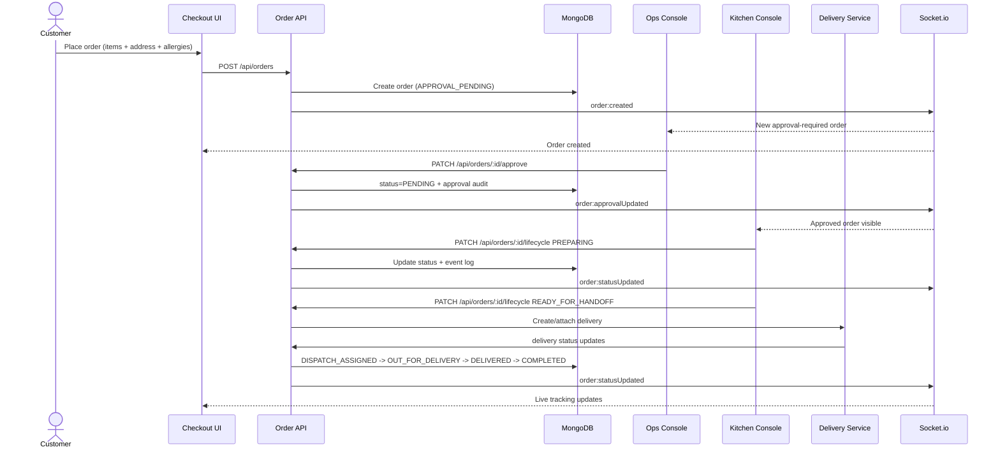
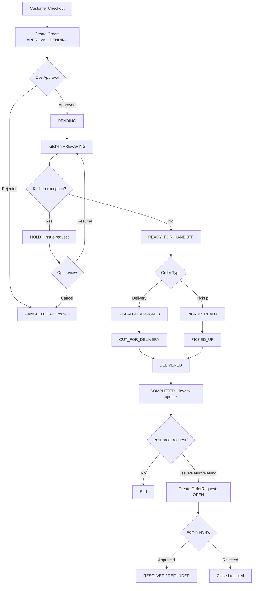
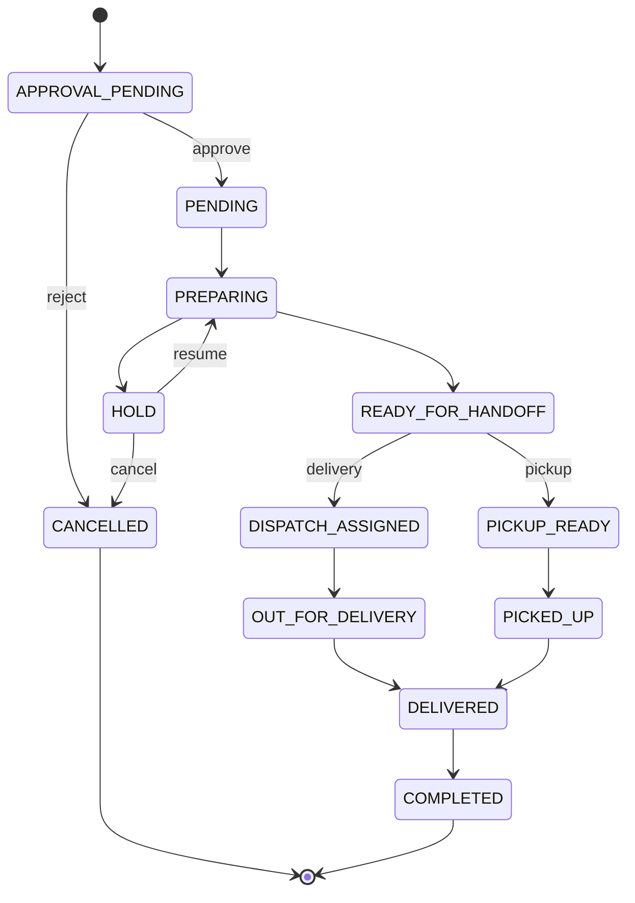

# Bake-Ree Order Lifecycle Architecture

This document is the canonical reference for the end-to-end order lifecycle across customer checkout, ops approval, kitchen execution, delivery, and post-order requests.

## 1) Architecture Diagram

```mermaid
flowchart LR
  subgraph FE[Frontend Apps]
    CUST[Customer App\n(/, /cart, /payment, /dashboard)]
    OPS[Ops Console\n(/ops/orders, /ops/logistics)]
    KDS[Kitchen Console\n(/kitchen)]
    TRK[Tracking UI\n(/track/:orderId)]
  end

  subgraph BE[Backend Services]
    API[Express REST API]
    SOCK[Socket.io Gateway]
    LIFE[Lifecycle/Approval Services]
    DEL[Delivery Services]
    LOY[Loyalty/Tier Services]
  end

  subgraph DB[Data Layer]
    MONGO[(MongoDB)]
  end

  CUST -->|REST| API
  OPS -->|REST| API
  KDS -->|REST| API
  TRK -->|REST| API

  CUST <-->|WS| SOCK
  OPS <-->|WS| SOCK
  KDS <-->|WS| SOCK
  TRK <-->|WS| SOCK

  API --> LIFE
  API --> DEL
  API --> LOY
  API <--> MONGO
  LIFE <--> MONGO
  DEL <--> MONGO
  LOY <--> MONGO
  API <--> SOCK
```

## 2) End-to-End Sequence Diagram



## 3) Complete System Flow Diagram



## 4) Order State Diagram (Implementation Authority)


